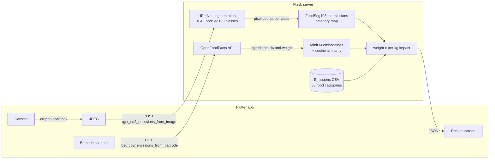

# Aftertaste

A mobile app that estimates the environmental cost of your food (CO2e, water use, land use) from a photo of a dish or a product barcode.

## What it does

- **Photo of a dish:** a semantic segmentation model labels each pixel with an ingredient, and the app estimates each ingredient's weight from how much of the image it covers.
- **Barcode of a packaged product:** looks up the product's ingredients and weight on OpenFoodFacts and matches each ingredient to an emissions category.
- **Breakdown:** shows total kg CO2e, liters of water, and m² of land, plus a per-ingredient list sorted by emissions.

## Demo

- [Photo of a dish](https://drive.google.com/file/d/137ZONrwQ90dX4xp2YaJRP0pelaqKwM0q/view?usp=sharing)
- [Barcode scan](https://drive.google.com/file/d/1P8Qr9hviFX_dzV5T9t_1XwwmXXeT5KcX/view?usp=sharing)

## Tech stack

- **Mobile app:** Flutter / Dart (`camerawesome`, `barcode_scan2`, `image`, `http`)
- **Backend:** Python, Flask
- **ML:** PyTorch, `segmentation_models_pytorch` (UPerNet + ResNet-50 encoder), Sentence Transformers (`all-MiniLM-L6-v2`), scikit-learn
- **Data:** FoodSeg103 (training), [Environment Impact of Food Production](https://www.kaggle.com/datasets/selfvivek/environment-impact-of-food-production) (emissions), [OpenFoodFacts API](https://world.openfoodfacts.org/data)

## Architecture

The Flutter app captures a photo or barcode and calls a Flask server, which does all the ML and lookups and returns a JSON map of `{food category: [kg CO2e, water, land]}`. The app sums the values and renders the breakdown.



**Image path.** The cropped photo is resized to 256x256 and run through a UPerNet model with a ResNet-50 encoder, trained on FoodSeg103 (training notebook on [Kaggle](https://www.kaggle.com/code/ishitamundra/foodseg103-try-1); mIoU 0.5680). Pixels below 0.35 softmax confidence are treated as background, and classes covering under 1% of the image are dropped. Each FoodSeg103 class is mapped by hand to one of the dataset's food categories (`data/foodseg103_to_co2.py`). Weight is estimated as pixel area x a fixed thickness x a per-food density, then multiplied by the per-kg CO2e, water, and land figures.

**Barcode path.** OpenFoodFacts provides the product weight and an estimated percentage for each ingredient. Ingredient names are free text ("cane sugar", "whole milk powder"), so each one is embedded with `all-MiniLM-L6-v2` and matched to the closest emissions category by cosine similarity instead of exact string matching. Ingredients under 0.01 kg CO2e are left out.

**Design decisions**
- **Server-side inference.** The segmentation model and sentence encoder run in Flask, not on device, which keeps the app light and lets the model change without an app release.
- **Segmentation instead of classification.** A dish is usually several ingredients. Per-pixel labels give both what is on the plate and roughly how much of each.
- **Hand-written class map for images, embeddings for barcodes.** The 104 FoodSeg103 classes are a fixed set, so a lookup table is exact. OpenFoodFacts ingredient text is open-ended, so it needs fuzzy matching.
- **Density column in the emissions CSV.** Impact figures are per kg, so the CSV carries a density per category to turn image area into weight.

## Project structure

```
main.py                      Flask app, two endpoints
food_segmentation_co2.py     UPerNet inference + image-based impact estimate
barcode_co2.py               OpenFoodFacts lookup + embedding match
data/
  Food_CO2_Emissions_Dataset.csv   per-kg CO2e, land, water, density
  foodseg103_to_co2.py             FoodSeg103 class -> emissions category
food_co2_emissions_app/
  lib/main.dart              app entry
  lib/camera_page.dart       camera, cropping, barcode scan, API calls
  lib/food_info.dart         results screen
  assets/                    logo and per-category food icons
test_data/                   sample food image
```

## Getting started

**Backend**

There is no `requirements.txt`; these are the packages the code imports:

```bash
pip install flask torch torchvision segmentation-models-pytorch pillow pandas \
    numpy requests scikit-learn sentence-transformers
```

Download the trained weights from the [Kaggle notebook](https://www.kaggle.com/code/ishitamundra/foodseg103-try-1) and save them as `models/best_model.pth` (not checked in). Then, from the repo root:

```bash
python main.py   # serves on 0.0.0.0:5000
```

**App**

The server address is hardcoded in `food_co2_emissions_app/lib/camera_page.dart` (`http://192.168.0.19:5000`). Change both URLs to your machine's LAN IP, then:

```bash
cd food_co2_emissions_app
flutter pub get
flutter run
```

Run it on a physical device, since it needs the camera.
